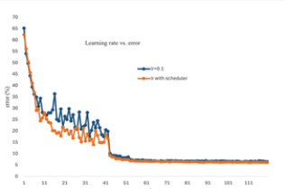

# DL-CIFAR-10

2025 spring DL first project

# ResNet for CIFAR-10: Exploring Depth and Hyperparameter Optimization

## Overview

This project investigates the impact of **Residual Neural Networks (ResNet)** on CIFAR-10 image classification. The study explores how **model depth, weight decay, learning rate scheduling, and number of parameters** affect accuracy. We compare **ResNet-110\[18,18,18\], ResNet-50\[3,4,6,3\], and ResNet-38\[6,6,6\]**, fine-tuning hyperparameters to identify the optimal configuration.

## Features

- Implementation of **ResNet architectures** using **PyTorch**
- **Experiments on hyperparameter tuning**, including:
  - Weight decay adjustments
  - Learning rate scheduling
  - Number of parameters
- **Comparison of model depth** on classification accuracy
- **Data augmentation techniques** for better generalization
- Training with **SGD (momentum) and Adam optimizers**
- **Learning rate warm-up and scheduled decay strategies**

## Dataset

**CIFAR-10 dataset**, consisting of:

- **50,000 training images**
- **10,000 validation images**
- **10 classes (airplane, automobile, bird, cat, deer, dog, frog, horse, ship, truck)**
- **Image size: 32×32 pixels (RGB)**

### Data Augmentation:

- Random cropping
- Horizontal flipping
- Gaussian blur
- Color jittering
- Random erasing
- Normalization

### Training Detail

- **Batch size**: 256
- **Optimizers**: SGD (momentum) and Adam, Adam converge faster, but SGD with momentum is more accurate in this experiemtn
- **Learning rate schedule**: MultiStepLR
  More detail is in data folder with training and Validation accuracy plot with different hyperparameters

## Results

### ResNet-110\[18,18,18\]:highest model (At folder 18,18,18 )

- **Training accuracy**: 97.03%
- **Validation accuracy**: 94.22%
- **Number of parameters**: 1.7M
- **Epoch**: 120
- **Optimizer**: SGD (momentum)
- **Learning rate schedule**: MultiStepLR
- **Weight decay**: 0.0005

### ResNet-50\[3,4,6,3\]

- **Training accuracy**: 98%
- **Validation accuracy**: 93.64%
- **Number of parameters**: 4.6M
- **Epoch**: 120
- **Optimizer**: SGD (momentum)
- **Learning rate schedule**: MultiStepLR
- **Weight decay**: 0.001

### ResNet-38\[6,6,6\]

- **Training accuracy**: 98.508%
- **Validation accuracy**: 94.62%
- **Number of parameters**: 4.6M
- **Epoch**: 120
- **Optimizer**: SGD (momentum)
- **Learning rate schedule**: MultiStepLR
- **Weight decay**: 0.001

### ResNet-110 table

### Weight Decay vs. error rate on ResNet-110

### \# parameters vs. error rate on ResNet-110

### Learning rate vs. error rate on ResNet-110

### Comparingn with different ResNet Architecture

## Finding

- Weight decay (5e-4) is optimal for ResNet-110, effectively preventing overfitting.
- Increasing the number of parameters improves accuracy.
- The deeper layer model, the more epoch to training before stablizing
- Unexpectedly, ResNet-38 achieved the highest accuracy, likely due to the absence of a 7×7 kernel and max pooling in the current setup, which may have impacted high-level feature extraction.
- Dropping the learning rate too early causes premature stabilization, limiting the model’s capacity for further learning and reducing accuracy on the validation test set.

## Future work

There are several ways to further improve model performance and generalization:
-CutMix/MixUp augmentation
-Knowledge distillation
-Modify initial layers: Add a 7×7 kernel layer with max pooling and increase stride to 2 or 3 to capture higher-level features.
-Using different optimizers and learning rate schedules
-Using different loss functions
-Expand data augmentation techniques: Incorporate AutoAugment, RandAugment, or Contrastive Learning to improve robustness.

## Reference

- Kaiming He, Xiangyu Zhang, Shaoqing ren and Jian Sun, 2015. Deep Residual Leaarning for Image Recognition. arXiv preprint. arXiv:1512.03385v1 [cs.CV]. Ithaca, NY: Cornell University Library.
